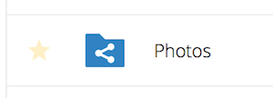

# Nextcloud Documentation

## User Guide for Nextcloud

&nbsp;

---
### What is Nextcloud?

&nbsp;

---
&nbsp;

Nextcloud is a document management system. It is used to share folders and files between others in your organization and also outsiders if you wish.

You can access Nextcloud in four ways:

### On your computer:
* In a web browser, like Google Chrome
* As a folder on your computer, similar to Dropbox or other cloud services

### On your mobile device:
* On iPhone or iPad
* On an Android phone or tablet

&nbsp;

---
### In a web browser on your computer

&nbsp;

---
&nbsp;

[Use Nextcloud in a web browser on your computer](#web-browser)

Using a web browser, you login to Nextcloud and then you can see all your documents and folders, as well as folders and documents shared with others. You can download, view and upload new documents, if you are given access to do so.

_Note - use a web browser if you are low on disk space on your computer_

You must have Internet access while using Nextcloud in a web browser.

---
### As a folder on your computer

&nbsp;

---
&nbsp;

[Use Nextcloud on your computer - Install on your computer](#desktop-client)

By installing the Nextcloud software, a folder on your computer will be kept in sync with the Nextcloud system, including all folders and documents you have been granted permission to access.

In this mode, you work directly on the files on your computer, and the Nextcloud software keeps it in sync with the Nextcloud server automatically.

_Note - using Nextcloud as a folder on your computer may use a lot of disk space. It will download a copy of all files and folders you have been granted permission to access, to your computer._

-> You can use your Nextcloud files and folders, even without an Internet connection. The next time you have an Internet connection, the Nextcloud software will synchronize the changes you and others have made to the files and folders.

* Second point
* Third point

---
### Web Browser Usage on a computer

&nbsp;

---
&nbsp;

Open your web browser and go to the Nextcloud server URL. You will a login page:

Enter your assigned username/email and password to login.

We recommend the latest versions of the following web browsers:

* [Google Chrome](https://www.google.com/chrome/)
* Apple Safari _(pre-installed on all Macs)_
* [Mozilla Firefox](http://getfirefox.com)
* Microsoft Edge _(pre-installed on Windows 10)_

You will see a web page similar to this:

Note the different areas on this page:

* Apps Selection Menu (1): Located in the upper left corner, you’ll find all your apps which are available on your instance of Nextcloud. Clicking on an apps icon will redirect you to the app.
* Apps Information field (2): Located in the left sidebar, this provides filters and tasks associated with your selected app. For example, when you are using the Files apps you have a special set of filters for quickly finding your files, such as files that have been shared with you, and files that you have shared with others. You’ll see different items for other apps.
* Application View (3): The main central field in the Nextcloud user interface. This field displays the contents or user features of your selected app.
* Navigation Bar (4): Located over the main viewing window (the Application View), this bar provides a type of breadcrumbs navigation that enables you to migrate to higher levels of the folder hierarchy up to the root level (home).
* New button (5): Located in the Navigation Bar, the New button enables you to create new files, new folders, or upload files.

> _**Note** You can also drag and drop files from your file manager into the Files Application View to upload them to your instance. Currently, the only Web browser that support drag-and-drop folders is Google Chrome._

* Search field (6): Click on the magnifier in the upper right hand corner of to search for files.
* Contacts Menu (7): Gives you an overview about your contacts and users on your server. Dependent on the given details and available apps, you can directly start a video call with them or send emails.
* Gallery button (8). This looks like four little squares, and takes you directly to your image gallery.
* Settings menu (9): Click on your profile picture, located to the right of the Search field, to open your Settings dropdown menu.    Your Settings page provides the following settings and features:
  * Links to download desktop and mobile apps
  * Password management
  * Name, email, and profile picture settings
  * Manage connected browsers and devices
  * Group memberships
  * Interface language settings
  * Manage notifications
  * Your Two-factor Settings
  * Nextcloud Version information

&nbsp;

---
### Accessing your files using the Nextcould Web interface

&nbsp;

---
&nbsp;

You can access your Nextcloud files with the Nextcloud Web interface and create, preview, edit, delete, share, and re-share files.

#### File controls

Nextcloud can display thumbnail previews for image files, MP3 covers, and text files, if this enabled by your server administrator. Hover your cursor over a file or folder to expose the controls for the following operations:

##### Favorites

Click the star to the left of the file icon to mark it as a favorite, and quickly find all of your favorites with the Favorites filter on the left sidebar.

##### Share

Share the file or folder with a group or other users, and create public shares with hyperlinks. You can also see who you have shared with already, and revoke shares by clicking the trash can icon.

You have five share permissions:

* Can share; allows the users you share with to re-share.
* Can edit; allows the users you share with to edit your shared files, and to collaborate using the Documents app.
* Create; allows the users you share with to create new files and add them to the share.
* Change; allows uploading a new version of a shared file and replacing it.
* Delete; allows the users you share with to delete shared files.

##### Overflow Menu

The Overflow menu (three dots) displays file details, and allows you to rename, download, or delete files.

_The Details view shows Activities, Sharing, and Versions information._

The **Settings** gear icon at the lower left allows you to show or hide hidden files in your Nextcloud Web interface. These are also called dotfiles, because they are prefixed with a dot, e.g. .mailfile. The dot tells your operating system to hide these files in your file browsers, unless you choose to display them. Usually these are configuration files, so having the option to hide them reduces clutter.

Hiding or displaying hidden files.

##### Previewing files

You can display uncompressed text files, OpenDocument files, videos, and image files in the Nextcloud embedded viewers by clicking on the file name. There may be other file types you can preview if your Nextcloud administrator has enabled them. If Nextcloud cannot display a file, it starts a download process and downloads the file to your computer.

##### Navigating inside your Nextcloud

Navigating through folders in Nextcloud is as simple as clicking on a folder to open it and using the back button on your browser to move to a previous level. Nextcloud also provides a navigation bar at the top of the Files field for quick navigation.

##### Sharing status icons

Any folder that has been shared is marked with the Shared overlay icon. Public link shares are marked with a chain link. Un-shared folders are blank.

##### Creating or uploading files and directories

Upload or create new files or folders directly in a Nextcloud folder by clicking on the New button in the Files app.

The New button provides the following options:

**Up arrow**

* Upload files from your computer into Nextcloud. You can also upload files by dragging and dropping them from your file manager.

**Text file**

* Creates a new text file and adds the file to your current folder.

**Folder**

* Creates a new folder in the current folder.

##### Selecting files or folders

You can select one or more files or folders by clicking on their checkboxes. To select all files in the current directory, click on the checkbox located at the top of the files listing.

When you select multiple files, you can delete all of them, or download them as a ZIP file by using the Delete or Download buttons that appear at the top.

> **Note** If the Download button is not visible, the administrator has disabled this feature.

Filtering the files view
The left sidebar on the Files page contains several filters for quickly sorting and managing your files.

All files
The default view; displays all files that you have access to.
Favorites
Files or folders marked with the yellow star.
Shared with you
Displays all files shared with you by another user or group.
Shared with others
Displays all files that you have shared with other users or groups.
Shared by link
Displays all files that are shared by you via public link.
External Storage (optional)
Files that you have access to on external storage devices and services such as Dropbox, Google, and Amazon S3.
Moving files
You can move files and folders by dragging and dropping them into any directory.

Change in share expiration date
In older versions of Nextcloud, you could set an expiration date on both local and public shares. Now you can set an expiration date only on public shares, and local shares do not expire when public shares expire. The only way to “expire” a local share is to click the trash can icon to un-share your files.

&nbsp;

---
### Desktop Client Usage

&nbsp;

---
&nbsp;

* Install Nextcloud

[click here to install Nextcloud](https://nextcloud.com/download/#install-clients) and then return here to continue

[view this document online](https://flaxton.github.io/NextcloudDocs/)

